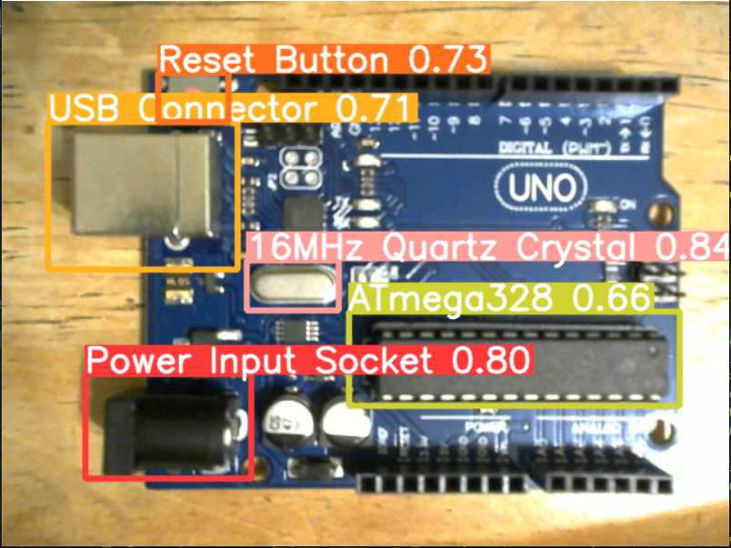

# Arduino-Uno-Component-Recognition-with-YOLOv5
This is one of my recent projects, which may be further refined in the future.
## Introduction
In this project, I attempted to utilize YOLOv5 7.0 along with a Logitech C270 webcam to perform object detection on various electronic components connected to an Arduino Uno. Most of the code requires execution within the environment provided by the official [YOLOv5](https://github.com/ultralytics/yolov5/tree/v7.0) repository. Simply replace the existing files to run the project seamlessly.
## Requirements
* [YOLOv5 7.0](https://github.com/ultralytics/yolov5/tree/v7.0)
* PIL
* torch
* torchvision
## Descriptions
I attempted to use a Logitech C270 webcam to recognize the following components on my Arduino Uno: Power Input Socket, 16MHz Quartz Crystal, Reset Button, USB Connector, and ATmega328 Microcontroller. Due to some degree of blurriness even after manually adjusting the camera's focus, I included some blurred images in the augmented dataset during data augmentation.

